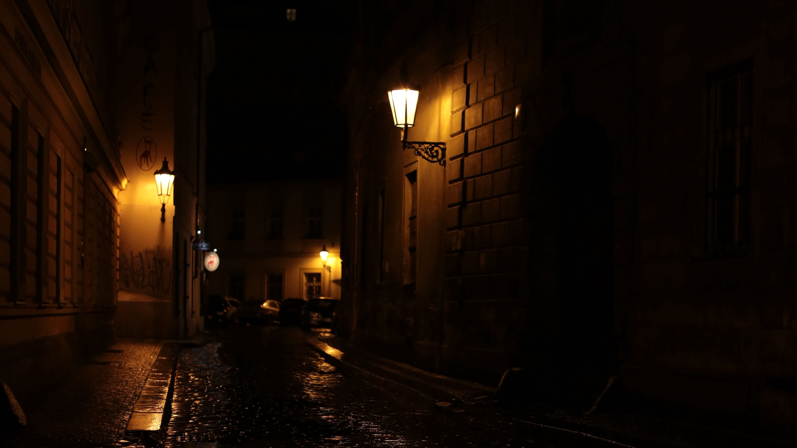
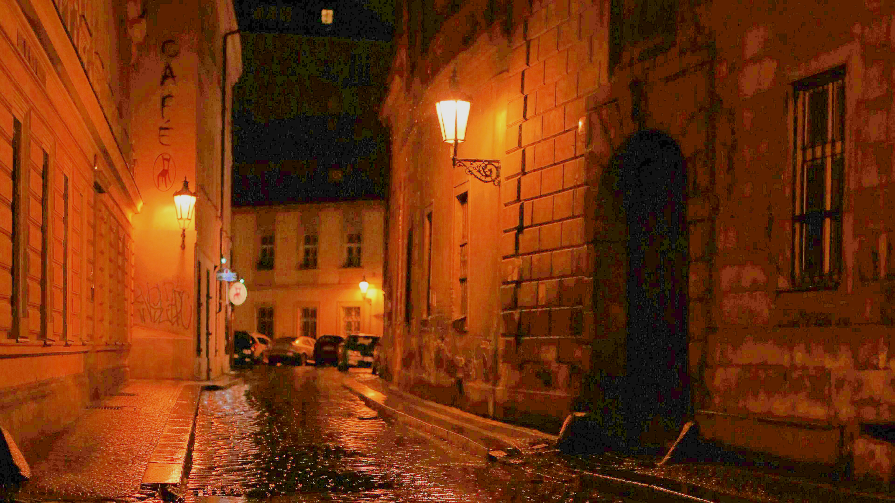
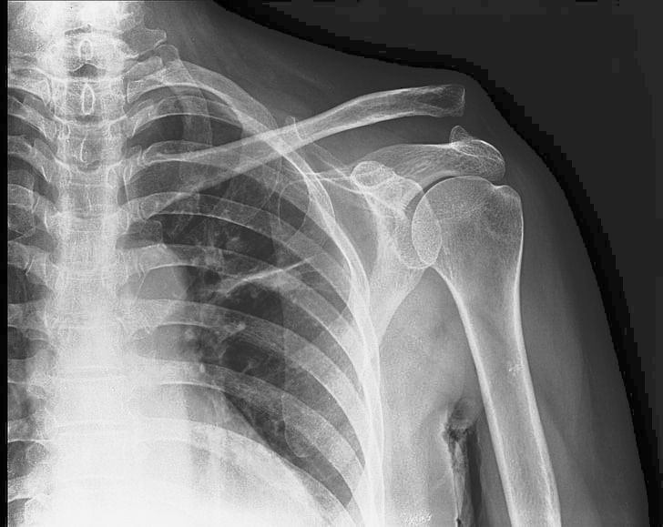

<a name="readme-top"></a>

# Polaris (Image Enhancement Program)
<!-- PROJECT LOGO -->
<!-- <br /> -->
<div align="center">
<!--  -->

</div>
<br />


<!-- TABLE OF CONTENTS -->
<details>
  <summary>Table of Contents</summary>
  <ol>
    <li>
      <a href="#about-the-project">About The Project</a>
      <ul>
        <li><a href="#built-with">Built With</a></li>
      </ul>
    </li>
    <li><a href="#introduction">Introduction</a></li>
    <li><a href="#algorithm">Algorithm</a></li>
    <li><a href="#examples">Examples</a></li>
    <li><a href="#benchmarks">Benchmarks</a></li>
    <li>
      <a href="#getting-started">Getting Started</a>
      <ul>
        <li><a href="#prerequisites">Prerequisites</a></li>
        <li><a href="#installation and usage">Installation</a></li>
      </ul>
    </li>
    <li><a href="#acknowledgements">Acknowledgements</a></li>
    <li><a href="#license">License</a></li>
    <li><a href="#contact">Contact</a></li>
  </ol>
</details>


<!-- ABOUT THE PROJECT -->
## About The Project

Polaris is a parallelized image enhancement program written in C++ and OpenMP 5.0. It uses ImageMagick to convert jpg/png images to PPM format and then applies image enhancement techniques including Gaussian filtering and histogram equalization in order to sharpen low-quality images and increase contrast for dark images.

### Built With
<!-- <br> -->

* C++20
* OpenMP 5.0
* ImageMagick

<p align="right">(<a href="#readme-top">back to top</a>)</p>

## Introduction

The fields of medical, UAV, and satellite imagery often generate images that are quite confusing and unintuitive to humans. Image enhancement is a frequently used technique to improve the visual quality and contrast of such images. In order to acquire digital images with good contrast, we balance the number of pixels with darker and brighter intensity in a local and/or global manner. Besides image quality, there is another problem with image processing applications, such as image size. As the image size gets bigger, it takes increasingly more time for computers to complete the given task. Parallel computing is a method that exploits several processing units on the same system to expedite the computation of individual pixels using data parallelism. One final problem is that most image formats, i.e. jpg, png, jpeg, etc, are compressed to some extent. In order to manipulate RGB pixels, we first convert all input images into the Portable PixMap (PPM) format, specifically P3.

## Algorithm

After preprocessing the input images to PPM, the algorithm works as follows, for each image in the target directory:

1. Create a PPM Object by reading the image file in memory.
2. Convert the RGB pixels of the PPM object into HSV colorspace values (for easier manipulation of lightness values).
3. Create a blurred image from the original using a 5x5 Gaussian filter.
4. Create an image mask of the original image using the blurred image.
5. Sharpen the image by subtracting the lightness values of the image mask from the original image. This gives us the locally enhanced image.
6. Send the original and the locally enhanced image to the Global Enhancement subroutine, which uses Histogram Equalization for enhancement. This returns the globally enhanced and the totally enhanced image.
7. Convert all 3 enhanced images from HSV colorspace back to RGB pixels in separate PPM objects.
8. Write the resulting 3 PPM objects to separate output files.
9. Convert the newly created PPM files into JPG using the ImageMagick utility.

| RGB Colorspace | HSV Colorspace |
| ------- | ------- |
|  |  |


## Examples

| Original image | Enhanced image |
| ---------------------- | ---------------------- |
|  |  |

| Original image | Enhanced image |
| ---------------------- | ---------------------- |
|  |  |

| Original image | Enhanced image |
| ---------------------- | ---------------------- |
|  |  |

<p align="right">(<a href="#readme-top">back to top</a>)</p>

## Benchmarks

<!-- | Sample 1 | Sample 2 | -->
<table>
<tr>
<td>
Sample 1 (84.9 MB)
</td>
<td>
Sample 2 (246.8 MB)
</td>
</tr>
<tr>
<td>

| Threads | Time |
| ------- | ------- |
| 1 | 17.78424 |
| 2 | 4.24503 |
| 3 | 13.85207 |
| 4 | 4.87121 |
| 5 | 4.18472 |
| 6 | 4.03638 |
| 7 | 14.59338 |
| 8 | 4.20575 |

</td>
<td>

| Threads | Time |
| ------- | ------- |
| 1 | 29.1509 |
| 2 | 11.8906 |
| 3 | 9.9716 |
| 4 | 13.3801 |
| 5 | 12.0371 |
| 6 | 11.7283 |
| 7 | 12.698 |
| 8 | 12.1187 |

</td>
</tr>
</table>

| Graph 1 | Graph 2 |
| ------- | ------- |
|  |  |

<!-- GETTING STARTED -->
## Getting Started
To get a local copy up and running follow these simple example steps.

### Prerequisites


* Any C++20 compiler (default g++)

  * For Debian-based distros
  ```sh
  apt install g++
  ```
  * For RPM-based distros
  ```sh
  yum install gcc-c++
  ```
* ImageMagick
  ```sh
  apt install imagemagick
  ```

### Installation and Usage

1. Clone the repository to your local machine.
   ```sh
   git clone https://github.com/OwaisK4/Parallel_Image_Enhancement
   ```
2. Change the dir_path inside the openmp_convert_images.cpp file and compile it using g++ (Make sure to pass the -fopenmp flag to link the OpenMP libraries).
   ```sh
   g++ openmp_convert_images.cpp -fopenmp -o openmp_convert_images
   ```
3. Run the resulting executable and select the "Convert to ppm" option to convert all images inside target dir_path to PPM3 format.
   ```sh
   ./openmp_convert_images
   ```

4. Change the dir_path inside the testing_ppm.cpp file and compile it using g++.
   ```sh
   g++ testing_ppm.cpp -fopenmp -o testing_ppm
   ```
5. Run the resulting executable, with no. of threads passed as argument, and wait for its completion. After it completes, each ppm file will have 3 matching enhanced images inside the dir_path folder.
   ```sh
   ./testing_ppm 8
   ```

<p align="right">(<a href="#readme-top">back to top</a>)</p>

## Acknowledgements

1. Hangün, Batuhan and Bayar, Salih, [An Openmp-Based Parallel Implementation of Image Enhancement Technique for Dark Images](https://dx.doi.org/10.2139/ssrn.4493946)

2. Chernov, Vladimir & Alander, Jarmo & Bochko, Vladimir. (2015). [Integer-based accurate conversion between RGB and HSV color spaces. Computers & Electrical Engineering.](https://doi.org/10.1016/j.compeleceng.2015.08.005)

<!-- LICENSE -->
## License

Distributed under the MIT License. See `LICENSE.txt` for more information.

<p align="right">(<a href="#readme-top">back to top</a>)</p>


<!-- CONTACT -->
## Contact

Owais Ali Khan - [@OwaisK484](https://twitter.com/OwaisK484) - owaisalikhan2003@gmail.com

Linkedin - [Profile](https://www.linkedin.com/in/owais-ali-khan-04933b238)

Project Link: [Parallel Image Enhancement](https://github.com/OwaisK4/Parallel_Image_Enhancement)

<p align="right">(<a href="#readme-top">back to top</a>)</p>
